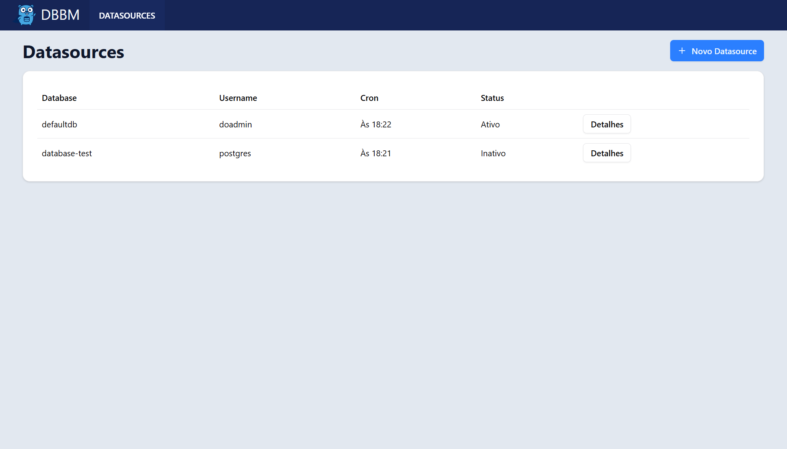
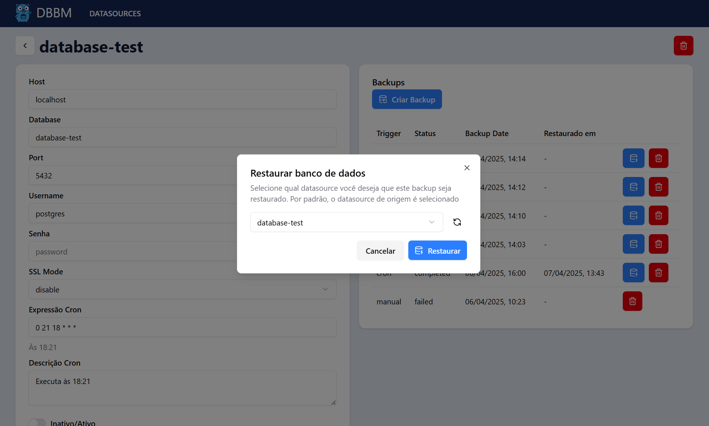

<p align="center" dir="auto">
  
</p>

# Database Backup Management - Frontend

Interface web para o sistema de gerenciamento de backups de bancos de dados. Desenvolvida em Next.js com Tailwind e ShadCN, conecta-se à [API backend](https://github.com/bvaledev/database-backup-management-be) para gerenciar datasources e operações de backup/restauração.

---

## 🚀 Funcionalidades

- 📋 Listagem de datasources cadastrados  
- ➕ Cadastro e edição de conexões com bancos PostgreSQL  
- 🔁 Execução de backups manuais ou via agendamento (cron)  
- ♻️ Restauração de backups em bancos de origem ou alternativos  
- 🗑️ Exclusão de backups e datasources  
- 📅 Visualização de status, datas de execução e histórico de restauração  
- 💻 Interface moderna, responsiva e acessível com shadcn/ui

---

## 🖼️ Demonstrações

### 📚 Lista de Datasources


### ⚙️ Detalhes do Datasource e Backups


### ♻️ Modal de Restauração de Backup


---

## ⚙️ Configuração

Crie um arquivo `.env.local` na raiz do projeto com a URL da API:

```env
NEXT_PUBLIC_API_URL=http://localhost:8080
```

---

## 📦 Instalação e execução

```bash
# Instale as dependências
npm install

# Execute a aplicação em modo de desenvolvimento
npm run dev
```

---

## 🛠️ Tecnologias

- [Next.js](https://nextjs.org/) — Framework React fullstack  
- [Tailwind CSS](https://tailwindcss.com/) — Estilização com classes utilitárias  
- [shadcn/ui](https://ui.shadcn.com/) — Componentes acessíveis e personalizáveis  
- [Zod](https://zod.dev/) — Validação de esquemas e formulários  
- [React Hook Form](https://react-hook-form.com/) — Manipulação de formulários  
- [Axios](https://axios-http.com/) — Requisições HTTP para comunicação com a API  
- [Lucide Icons](https://lucide.dev/) — Ícones modernos SVG  

---

## ✍️ Autor

Desenvolvido por [@bvaledev](https://github.com/bvaledev)

---

## 🔗 Repositórios

- 📦 [Backend - database-backup-management-be](https://github.com/bvaledev/database-backup-management-be)

---

## ⚠️ Observações

- A aplicação depende do backend para funcionar corretamente.  
- Funcionalidade de restauração utiliza a API para processar os backups.  
- O frontend detecta automaticamente se o cron está ativo e exibe as próximas execuções.